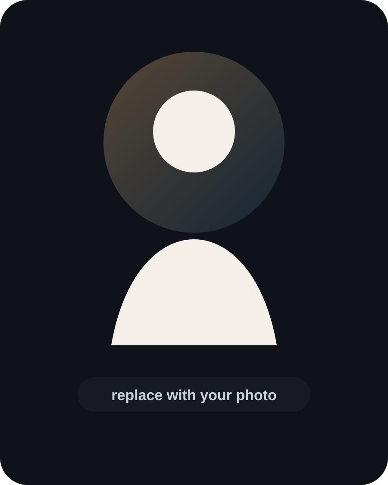

# Idris Responsive Animated Cinematic Portfolio

Профессиональный адаптивный сайт-портфолио для Telegram-ботов и сайтов.

## Что улучшено

- Полная адаптация под компьютер, ноутбук, планшет и телефон
- Более привлекательные тексты
- Отдельные разделы для ботов и сайтов
- Пустые шаблоны карточек для будущих проектов
- Cinematic-дизайн
- Animated aurora background
- Particles
- Cursor glow
- Reveal animations
- Animated title
- Floating badges
- Counter animation
- 3D tilt project cards
- Magnetic buttons
- Modal animations
- Mobile-friendly layout

## Как заменить фото

1. Положи своё фото в папку:

```txt
assets/
```

2. Назови файл:

```txt
profile.jpg
```

3. В `index.html` замени:

```html

```

на:

```html

```

## Как заполнить проекты

В `index.html` есть две главные секции:

```html
<section class="projects-section" id="bots">
<section class="projects-section" id="sites">
```

`bots` — для Telegram-ботов.  
`sites` — для сайтов.

В каждой карточке замени:

- название проекта
- короткое описание
- функции в `<span>`
- текст в модальном окне
- ссылку `href="#"`

## Как поставить контакты

В секции `contacts` замени пустые ссылки:

```html
<a href="#" class="btn btn-ghost magnetic">Instagram</a>
<a href="#" class="btn btn-primary magnetic">Telegram</a>
```

на свои:

```html
<a href="https://instagram.com/idris_codes" class="btn btn-ghost magnetic">Instagram</a>
<a href="https://t.me/idris.codes" class="btn btn-primary magnetic">Telegram</a>
```

## Запуск

Просто открой `index.html` в браузере.

## Публикация

Можно загрузить на:

- GitHub Pages
- Netlify
- Vercel
- Railway
